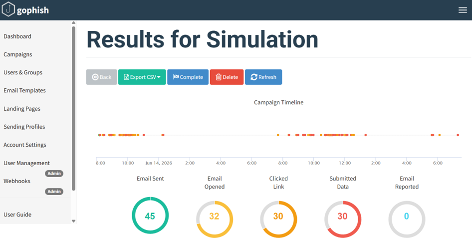
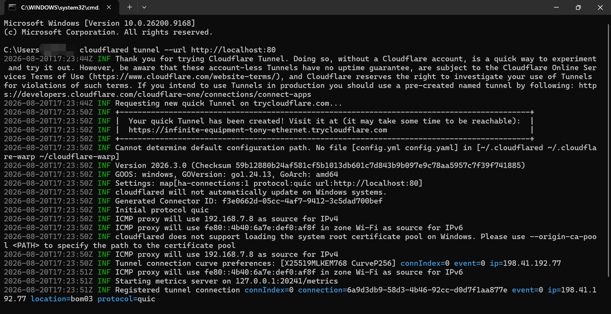
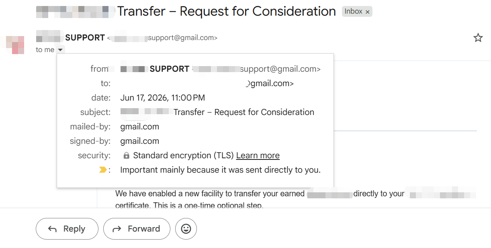
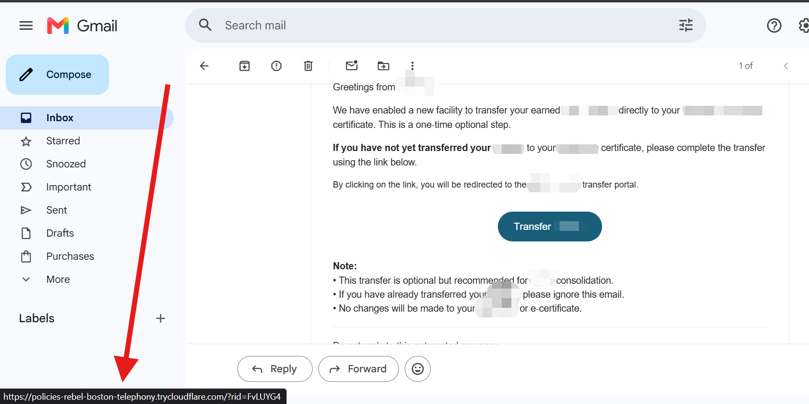
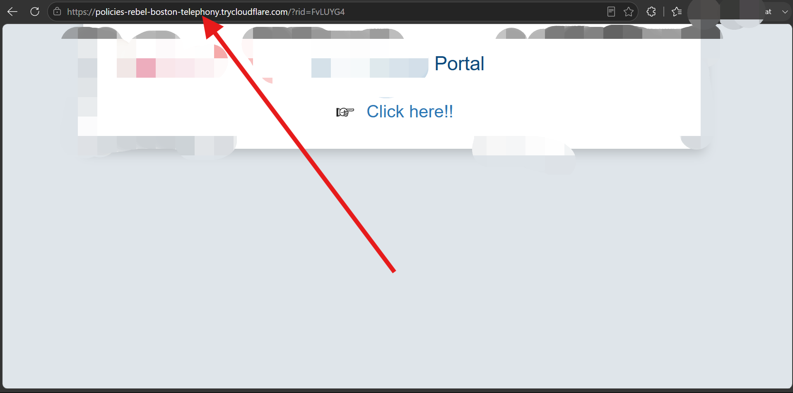

<div align="center">

# 🎣 Phishing Simulation using GoPhish

**A controlled, authorized security-awareness exercise covering campaign design, mail delivery, real-time analytics, and a post campaign debrief.**


</div>

---

### 📌 At a Glance

| | |
|---|---|
| **Goal** | Measure real-world phishing susceptibility and turn it into an awareness-training moment |
| **Stack** | GoPhish · Cloudflare Tunnel · Gmail SMTP |
| **Audience** | 45 recipients, single time-boxed campaign (24 hrs) |
| **Headline result** | 66.7% submitted data → **0% reported** |
| **Outcome** | Every participant debriefed on the 3 red flags used in the simulation |

---

> ### ⚠️ Ethics & Authorization
> This was an internal, educational security-awareness exercise run against a defined, known audience with a time-boxed window, followed by full disclosure to every participant. No real credentials were misused, shared, or retained beyond what was needed to measure engagement. The target brand's assets are **not reproduced in this repo** — see [What's Intentionally Left Out](#-whats-intentionally-left-out).
>
> Phishing simulations should only ever be run with clear authorization from the organization/individual commissioning the exercise, in line with applicable policy and law. This repo documents the technical workflow for educational reference — it is not an endorsement to run unauthorized campaigns against third parties.

---

## 📋 Table of Contents

- [What I Built](#-what-i-built)
- [Results](#-results)
- [Exposing the Server — Cloudflare Quick Tunnel](#-exposing-the-server--cloudflare-quick-tunnel)
- [Post-Campaign Debrief](#-post-campaign-debrief--red-flags-taught-to-participants)
- [Challenges & Fixes](#-challenges--fixes)
- [Tools Used](#-tools-used)
- [What's Intentionally Left Out](#-whats-intentionally-left-out)
- [Skills Demonstrated](#-skills-demonstrated)
- [References](#-references)

---

## 🛠 What I Built

- Installed and configured **GoPhish** as a phishing-simulation framework
- Configured a working **SMTP sending profile** (Gmail + App Password), a **target group**, an **HTML email template**, and a **credential-capture landing page**
- Exposed the locally hosted landing page to the internet using a **Cloudflare Quick Tunnel**
  ```bash
  cloudflared tunnel --url http://localhost:80
  ```
- Launched a live campaign and monitored engagement in real time (sent → opened → clicked → submitted → reported)
- Closed the loop with a **post-campaign debrief email** teaching all participants the red flags used in the simulation

---

## 📊 Results

<div align="center">

| Metric | Count | Rate |
|:---|:---:|:---:|
| 📧 Email Sent | 45 | 100% |
| 👀 Email Opened | 32 | 71.1% |
| 🖱️ Clicked Link | 30 | 66.7% |
| 🔓 Submitted Data | 30 | 66.7% |
| 🚩 Email Reported | 0 | **0%** |

</div>



> **🔑 Key finding:** zero recipients reported the email as suspicious within 24 hours — a bigger gap than the click rate itself, and a concrete, actionable finding for the organization (reporting habits/tooling, not just awareness).

---

## 🌐 Exposing the Server — Cloudflare Quick Tunnel

```bash
cloudflared tunnel --url http://localhost:80
```



Quick Tunnels are account-less and convenient, but generate a new random `trycloudflare.com` subdomain on every restart and carry no uptime guarantee — fine for a single time-boxed run, not for recurring simulations (a persistent named tunnel would be the fix there).

---

## 📬 Post-Campaign Debrief — Red Flags Taught to Participants

After the 24-hour window closed, every participant received a debrief email disclosing the simulation and walking through the 3 red flags it was built on:

<table>
<tr>
<td width="50%">

**1️⃣ Sender address mismatch**
The email came from a generic Gmail address, not an official organizational domain.



</td>
<td width="50%">

**2️⃣ Unverified link destination**
Hovering/long-pressing the CTA button revealed the real (tunnel) URL before ever clicking.



</td>
</tr>
<tr>
<td width="50%" colspan="2">

**3️⃣ Unfamiliar domain in the address bar**
Even after clicking through, the address bar showed a public tunnel subdomain instead of an official domain.



</td>
</tr>
</table>

**✅ Takeaways shared with participants:**
- Examine the "From" address — official organizations don't send from generic Gmail/Outlook/Yahoo
- Right-click / long-press links before clicking to check the real destination
- Check the address bar before logging in — watch for tunnelling services like `trycloudflare.com` or `ngrok.io`
- Watch for urgency language ("one-time step", "immediate action") designed to short-circuit careful reading
- When in doubt, navigate to the official site manually instead of clicking

---

## 🧩 Challenges & Fixes

| # | Challenge | Root Cause | Fix |
|:---:|---|---|---|
| 1 | First two email pretexts landed in **Spam**, not Inbox | GoPhish only logs "sent" — mail delivered to Spam produces silent zero engagement, no visible error | Diagnosed by testing two different well-known-brand pretexts and seeing the same failure, pointing to sender reputation / brand-keyword filtering. Switched to a narrower, less brand-guarded pretext, which reached the inbox |
| 2 | Lookalike domains got **suspended instantly** | Registrar abuse-detection flagged outgoing mail as phishing before the campaign could run | Abandoned the lookalike-domain approach; relied on Gmail SMTP + Cloudflare Tunnel instead |
| 3 | Deliverability risk from **tracking pixels** | Heavy HTML / tracking images are commonly flagged by spam filters | Left "Add Tracking Image" unchecked in the email template |

> 💡 This trial-and-error was itself a finding: impersonating a well-known tech brand triggered spam filters and domain-abuse detection far faster than a narrower organizational pretext, even with identical delivery infrastructure across every attempt.

---

## 🧰 Tools Used

| Tool | Purpose |
|---|---|
| [**GoPhish**](https://github.com/gophish/gophish) | Phishing campaign framework — email delivery, landing pages, tracking |
| [**cloudflared**](https://github.com/cloudflare/cloudflared) (Cloudflare Tunnel) | Exposes the local landing page (port 80) to the public internet |
| **Gmail SMTP** (App Password) | Sending profile used to relay simulation emails |

---

## 🔒 What's Intentionally Left Out

To keep this repo educational rather than a reusable attack kit, the following are **not included**:
- The actual phishing email HTML and cloned landing-page HTML/templates
- The specific brand impersonated in the live campaign, and any lookalike-domain details tried along the way
- Real participant data, credentials, or the sending account's App Password
- Raw screenshots of the unannotated phishing email/landing page as received

If you're building something similar, the write-up above covers the methodology, metrics, and lessons in full — that's the part worth sharing.

---

## 🎯 Skills Demonstrated

`Phishing campaign design` · `Email deliverability & spam-filter behavior` · `Tunnelling / exposure techniques` · `Campaign analytics interpretation` · `Responsible, awareness-focused closure of a simulated social-engineering test`

---

## 📚 References

- [GoPhish Documentation](https://github.com/gophish/gophish)
- [Cloudflare Tunnel Documentation](https://developers.cloudflare.com/cloudflare-one/connections/connect-networks/)
- [Quick Tunnels (TryCloudflare)](https://developers.cloudflare.com/cloudflare-one/connections/connect-networks/do-more-with-tunnels/trycloudflare/)

<div align="center">

---

⭐ If you found this write-up useful, consider starring the repo!

</div>
